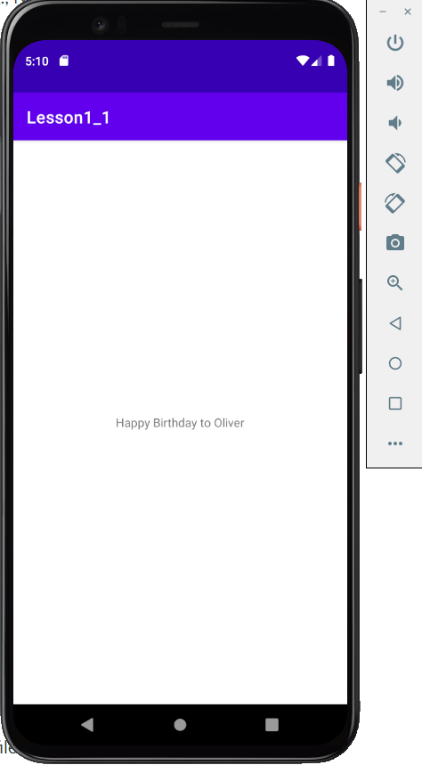

# Android fundamentals 01.1: Android Studio and Hello World

- **Link to code base: [lesson1_1](https://github.com/zhuxinyishcn/NEUSEA-XinyiZhu/tree/main/lesson1_1)**

- Screenshots  
  

## Things I learned/questions

- I can add customize logging message display in the Logcat pane to help me debug.
- I can create/test a new emulator by using AVD Manager.
- I can change minimum SDK version for the app in build.gradle(Module:app) file.

## Homework

1. What is the name of the layout file for the main activity?

- MainActivity.java

2. What is the name of the string resource that specifies the application's name?

- applicationId

3. Which tool do you use to create a new emulator?

- AVD Manager

4. Assume that your app includes this logging statement:

   ```Java
   Log.i("MainActivity", "MainActivity layout is complete");
   ```

   You see the statement "MainActivity layout is complete" in the Logcat pane if the Log level menu is set to which of the following? (Hint: multiple answers are OK.)

   - Verbose
   - Info

### Screenshots of homework

- 
