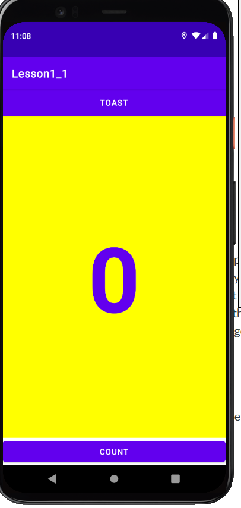

- **Link to code base (I built from lesson 1, so there is no new folder): [lesson1_2a](https://github.com/zhuxinyishcn/NEUSEA-XinyiZhu/tree/main/lesson1_1)**

- Screenshots  
   
  

## Things I learned/questions

- I can add customize button size and font to the button.
- I can extract string resources to represent strings that I want to display on the screen.
- I can display a toast message with customizing text and duration time.
